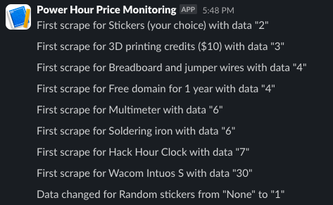

# Scrape and Ntfy  
An extremely customizable web scraper with a modular notification system and persistent storage via SQLite.  

## Features  
- Modular notification system  
    - Currently supports Webhooks (e.g. Discord, Slack, etc.) and [ntfy.sh](https://ntfy.sh)  
- Web scraping via Selenium  
- Simple configuration of multiple scrapers with conditional notifications  

## Usage
### Prerequisites
- A browser
    - Most Chromium-based browsers and Firefox-based browsers should work
    - Edge is not recommended  
    - Selenium should also be able to download and cache the appropriate browser if necessary  
### Basic Configuration  
- Configuration for the web scraper is handled through a TOML file
    - To see an example configuration, see `config.example.toml`  
    - This can be copied to `config.toml` and edited to suit your needs
    - To get the CSS selector for an element, you can use your browser's developer tools (`F12`, `Ctrl+Shift+I`, right-click -> Inspect Element, etc.)  
        1. If you're not already in inspect, you can press `Ctrl+Shift+C` to enter inspect element mode (or just click the inspect button in the developer tools)  
        2. Click on the element you want to select  
        3. Right-click on the element in the HTML pane
        4. Click "Copy" -> "Copy selector"
- Some other configuration is handled through environment variables and/or command-line arguments (`--help` for more information)  
    - For example, to set the path to the configuration file, you can set the `PATH_TO_TOML` environment variable or use the `--path-to-toml` command-line argument  
### Docker (Recommended)  
#### Specific perquisites  
- Docker  
    - [Docker](https://docs.docker.com/get-docker/) is a platform for developing, shipping, and running applications in containers  
- Docker Compose  
#### Installation and usage  
1. Clone the repository  
    - `git clone https://github.com/slashtechno/scrape-and-ntfy`
2. Change directory into the repository
    - `cd scrape-and-ntfy`
3. Configure via `config.toml`  
    - Optionally, you can configure some other options via environment variables or command-line arguments in the `docker-compose.yml` file  
4. `docker compose up -d`
    - The `-d` flag runs the containers in the background
    - If you want, you can run [`sqlite-web`](https://github.com/coleifer/sqlite-web) by uncommenting the appropriate lines in `docker-compose.yml` to view the database in a browser on [localhost:5050](http://localhost:5050)  

### `pip`  
#### Specific perquisites  
- Python (3.11+)
#### Installation and usage  
1. Install with `pip`  
    - `pip install scrape-and-ntfy`  
    - Depending on your system, you may need to use `pip3` instead of `pip` or `python3 -m pip`/`python -m pip`.  
2. Configure  
3. Run `scrape-and-ntfy`  
    - This assumes `pip`-installed scripts are in your `PATH`  

### PDM  
#### Specific perquisites
- Python (3.11+)  
- [PDM](https://pdm-project.org/en/latest/)
#### Installation and usage  
1. Clone the repository  
    - `git clone https://github.com/slashtechno/scrape-and-ntfy`
2. Change directory into the repository
    - `cd scrape-and-ntfy`  
3. Run `pdm install`  
    - This will install the dependencies in a virtual environment  
    - You may need to specify an interpreter with `pdm use`  
4. Configure  
5. `pdm run python -m scrape_and_ntfy`  
    - This will run the bot with the configuration in `config.toml`
